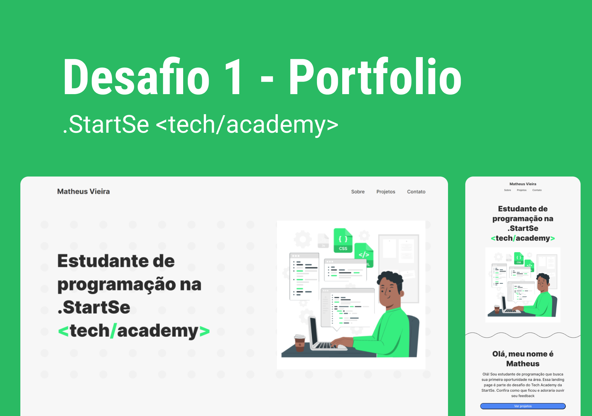

<h1 align="center">📁 Portfolio- Landing Page (Desafio#1)</h1>

  <strong>Landing page realizada para o primeiro desafio do Tech Academy da .StartSe</strong>

  

### Site 💻

- [Landing Page- Portfolio](https://desafio1-techacademy.netlify.app)

## Linguagens: 🚀
- HTML
- CSS

## Referências: ⌨️

- [StorySet](https://storyset.com)
- [Ming Cute - Designed Icon Library](https://www.mingcute.com)
